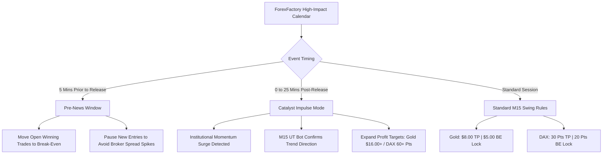

# AlphaEdge M15 Swing & News Catalyst Trading Engine

AlphaEdge is an institutional-grade autonomous trading system built for **MetaTrader 5 (MT5)**, powered by a mathematical replication of the **TradingView HPotter UT Bot (Version 6)**.

The engine executes exclusively on the **15-Minute (M15) timeframe**, combining swing trend-following with a **Dynamic Break-Even Shield** and real-time **Macro News Catalyst Guidance** across **Gold (`XAUUSDm`)** and **DAX (`DE30m`)**.

---

## 🏛️ Core Strategy & Math (TradingView 1:1 Parity)

The engine replicates TradingView Pine Script with mathematical precision:
1. **Wilder's Smoothing ATR (RMA)**:
   $$\text{ATR}_i = \frac{\text{TR}_i + 9.0 \times \text{ATR}_{i-1}}{10.0}$$
   Replicates TradingView's native `ta.rma(tr, 10)`.
2. **Recursive Trailing Stop**:
   Implements `f_calcTrailingStop` with `Key Value = 1.0` and `ATR Period = 10`.
3. **Signal Confirmation**:
   - **Strong Buy**: `ta.crossover(close, stop) and close > stop and close > close[1]`
   - **Strong Sell**: `ta.crossover(stop, close) and close < stop and close < close[1]`
   - Signals are confirmed on **completed candle close** (`index -2`), eliminating repainting.
4. **Instant Reversal**:
   When an opposite verified signal occurs, the engine closes the active trade immediately and flips direction to ride the new trend without lag.

---

## 🎯 Asset Profiles & Risk Controls

| Parameter | Gold (`XAUUSDm`) | DAX (`DE30m`) |
| :--- | :---: | :---: |
| **Execution Timeframe** | 15-Minute (`M15`) | 15-Minute (`M15`) |
| **Volume Size** | `0.01 Lot` (Micro Risk) | `0.07 Lot` (Broker Minimum) |
| **Take Profit (Standard)** | **+$8.00 USD** | **30 Index Points** (~$2.10) |
| **Take Profit (News Catalyst)** | **+$16.00 USD** | **60 Index Points** (~$4.20) |
| **Dynamic Break-Even Trigger** | **+$5.00 USD** | **20 Index Points** |
| **Stop Loss Formula** | $1.2 \times \text{ATR}$ below/above entry | $1.2 \times \text{ATR}$ below/above entry |

### 🛡️ Dynamic Break-Even Shield
To eliminate fakeout losses and protect profits:
- As soon as a Gold position gains **+$5.00** (or DAX gains **+20 points**), the engine shifts the Stop Loss to **Entry Price + Spread**.
- If the market stalls or reverses, the trade exits at **Break-Even (Zero Loss)**, preserving 100% of trading capital.

---

## ⚡ News Catalyst Guidance Engine (`news_catalyst_engine.py`)

AlphaEdge integrates real-time macro fundamentals from ForexFactory / FairEconomy covering High-Impact releases for **USD** (Gold) and **EUR** (DAX):



* **Pre-News Protection (5m prior)**: Pauses new entries to avoid artificial broker spread widening and locks Break-Even on winning positions.
* **Catalyst Impulse (0 to 25m post-release)**: When institutional volume enters (NFP, CPI, PPI, ECB decisions), the engine automatically expands Take Profit to capture multi-candle macro runs.
* **Persistent Disk Cache**: Caches events locally (`economic_calendar_cache.json`) to prevent rate-limiting.

---

## ⏰ Active Trading Sessions

AlphaEdge trades continuously through the high-volume European and American sessions:
- **Active Hours**: **07:00 UTC to 21:00 UTC** (London Open through New York Close).
- **Session Lock**: Automatically pauses entries during the late Asian dead-zone (21:00 to 07:00 UTC) and market weekends (Friday 21:00 UTC to Sunday 22:00 UTC) to prevent low-liquidity whipsaws.

---

## 🚀 How to Run the Bot

Launch the unified system with a single command:

```powershell
python alphaedge.py
```

### What Initializes:
1. **M15 Swing Engine**: Continuous monitoring of `XAUUSDm` and `DE30m`.
2. **News Catalyst Engine**: Live background calendar tracking.
3. **Telegram Command Listener**: Supports interactive commands directly from your phone:
   - `/status` — View open positions, floating PnL, and current market state.
   - `/start_scanner` — Resume scanning.
   - `/stop_scanner` — Pause new trade execution.
4. **Daily & Weekly Reports**: Dispatches automated end-of-day and weekly performance reports to Telegram.

---

## 📂 Project Architecture

* `alphaedge.py` — Master bot entrypoint, session manager, Telegram bot listener, and reporting scheduler.
* `scalping_gold.py` — The core M15 execution engine, Pine Script mathematical calculations, and Break-Even management for Gold & DAX.
* `news_catalyst_engine.py` — Real-time ForexFactory institutional news tracker with disk persistence.
* `economic_calendar_cache.json` — Persistent local cache for economic calendar events.
* `config_learned_scalp.json` — Parameters dynamically calibrated by the AI Auto-Learning Brain.
* `ut_bot_strategy.pine` — Reference TradingView Pine Script (`@version=6`) for visual chart comparison.
